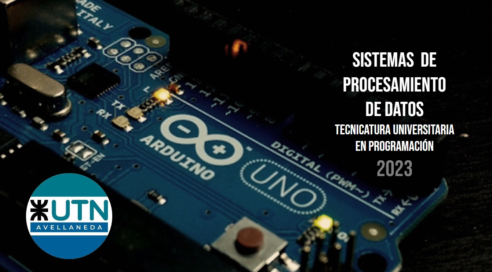
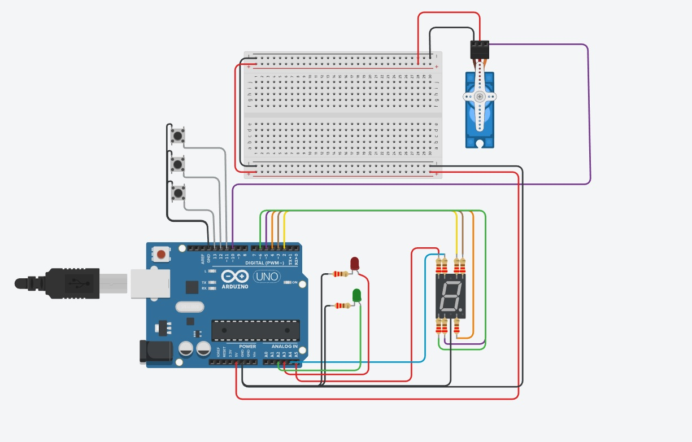
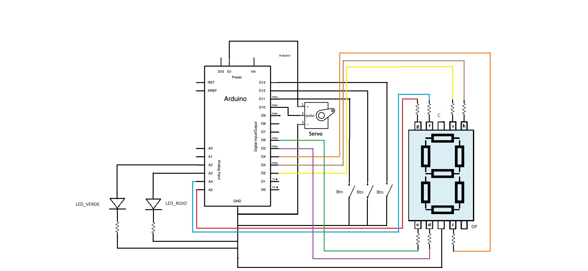

# Parcial1_SPD
Primer parcial SPD

# Sistema de procesamiento de datos 

## Integrantes 
- Eduardo Cruz

## Proyecto: Modelo de montacarga funcional.

## Descripción
El modelo de montacarga que diseño consta de 2 pisos que se inicializa el movimiento al accionar el pulsador de subir parando
en el siguiento piso prendiendo con un led verde en cada parada, tambien tiene un pulsador de bajar que tambien cuenta del led verde y tiene un un pulsador de detenerse que activa el led avisando que se detuvo.

## Función principal
---
- Son define para los pines de los led:
LED_ROJO
LED_VERDE

- Son define para los pines de los botones:
BOTON_SUBIR 
BOTOR_DETENER 
BOTON_BAJAR 

- Son define para los pines de los 7 segmentos:
ROJO 
CELESTE 
AMARILLO 
MARRON 
VERDE 
VIOLETA 
NARANJA 

//IF SUBIR 
-  if(estadoBotonSubir == 0)
  Esta condicon manda señal (1) al led verde y señal(0) al led rojo. 
  Suma al acumulador un valor que sera evaluado en el Switch.

//if DETENER
-   if(estadoBotonDetener == 0)
   Esta condicon manda señal (0) al led verde y señal(1) al led rojo. 
   Muestra en Serial Monitor que se detuvo.

//IF BAJAR
-   if(estadoBotonBajar == 0)
  Esta condicon manda señal (1) al led verde y señal(0) al led rojo. 
  Resta al acumulador un valor que sera evaluado en el Switch.

//FUNCIONES

- pisoUno();
Esta funcion les da señal a los pines 3 y 4 formando el numero 1 en le 7 segmentos.
Muestra en piso en el que se encuentra -> Piso uno.

- pisoDos();
Esta funcion les da señal a los pines A5, 2, 3, 5 y 6 formando el numero 2 en le 7 segmentos
Muestra en piso en el que se encuentra -> Piso dos.

- pisoTres();
Esta funcion les da señal a los pines 4, A5, 2, 3 y 5 formando el numero 3 en le 7 segmentos
Muestra en piso en el que se encuentra -> Piso tres.

- moverServo();
Esta funcion posiciona el servo segun el angulo pasado como parametro. 
---

~~~ C (lenguaje en el que esta escrito)

//Eduardo Cruz
//Parcial 1

// SERVOS
#include <Servo.h>
Servo Servo1;

//LEDS
#define LED_ROJO A3
#define LED_VERDE A2

//BOTONES BOTON_SUBIR
#define BOTON_SUBIR 11
#define BOTOR_DETENER 12
#define BOTON_BAJAR 13

//7 SEGMENTOS
#define ROJO A5
#define CELESTE A4
#define AMARILLO 2
#define MARRON 3
#define VERDE 6
#define VIOLETA 5
#define NARANJA 4

//ESTADOS DE BOTONES
int estadoBotonSubir;
int estadoBotonDetener;
int estadoBotonBajar;

//PIN SERVOS
int servoPin = 10;

//VARIABLES DE OPERACION
int tiempo = 3000;
int acumulador_tiempo = 0;

//FIRMA DE FUNCION
void moverServo(int grados);

void setup()
{
  //SERVO
  Servo1.attach(servoPin);
  //LEDS
  pinMode(LED_ROJO, OUTPUT);
  pinMode(LED_VERDE, OUTPUT);
  //BOTONES
  pinMode(BOTON_SUBIR, INPUT_PULLUP);
  pinMode(BOTOR_DETENER, INPUT_PULLUP);
  pinMode(BOTON_BAJAR, INPUT_PULLUP);
  //7 SEGMENTOS
  pinMode(ROJO, OUTPUT);
  pinMode(CELESTE, OUTPUT);
  pinMode(AMARILLO, OUTPUT);
  pinMode(MARRON, OUTPUT);
  pinMode(VERDE, OUTPUT);
  pinMode(VIOLETA,OUTPUT);
  pinMode(NARANJA, OUTPUT);
//SERIAL
  Serial.begin(9600);
}

void loop()
{
  //Serial.println(acumulador_tiempo);
 
  //ESTADOS DE LECTURA
  estadoBotonSubir = digitalRead(BOTON_SUBIR);
  estadoBotonDetener = digitalRead(BOTOR_DETENER);
  estadoBotonBajar = digitalRead(BOTON_BAJAR);
  
  //SUBIR 
  if(estadoBotonSubir == 0){ 
    digitalWrite(LED_VERDE, 1);
    digitalWrite(LED_ROJO, 0);
    acumulador_tiempo = acumulador_tiempo + tiempo;  
  }
  
  //DETENER
   if(estadoBotonDetener == 0){   
     digitalWrite(LED_VERDE, 0);
     digitalWrite(LED_ROJO, 1);
     Serial.println("el piso se detuvo");       
  }
  
  //BAJAR
   if(estadoBotonBajar == 0){     
     digitalWrite(LED_VERDE, 1);
     digitalWrite(LED_ROJO, 0);
     acumulador_tiempo = acumulador_tiempo - tiempo;
    }
  //NO DEJA QUE SEA MENOR PARA TRABAJR EN EL RANGO ENTRE 0 A 6000
  if(acumulador_tiempo < 3000){
  	acumulador_tiempo = 0;
  }
  //NO DEJA QUE SEA MAYOR PARA TRABAJR EN EL RANGO ENTRE 0 A 6000
   if(acumulador_tiempo > 9000){
  	acumulador_tiempo = 6000;
  }
  
   //7 SEGMENTOS
   switch(acumulador_tiempo){

      case 0:
	 		pisoUno();   		
     		moverServo(0);
       		break;
     
      case 3000:
      		pisoDos();   		
     		moverServo(90);	
      		break;

      case 6000:
       		pisoTres();   		
            moverServo(180);
        	break;
    } 
}

//MUESTRA EL 1ER PISO EN EL 7 SEGMENTOS
void pisoUno(){
    Serial.println("piso uno");
    digitalWrite(ROJO,0);
    digitalWrite(AMARILLO,0);
    digitalWrite(MARRON,1);
    digitalWrite(VIOLETA,0);
    digitalWrite(NARANJA,1);
    digitalWrite(VERDE,0);
    delay(200);
}

//MUESTRA EL 2DO PISO EN EL 7 SEGMENTOS
void pisoDos(){
    Serial.println("piso dos"); 
    digitalWrite(NARANJA,0);
  	digitalWrite(ROJO,1);
    digitalWrite(AMARILLO,1);
    digitalWrite(MARRON,1); 
    digitalWrite(VIOLETA,1);
    digitalWrite(VERDE,1);
    delay(200);
}

//MUESTRA EL 3ER PISO EN EL 7 SEGMENTOS
void pisoTres(){
    Serial.println("piso tres"); 
    digitalWrite(MARRON,0);
    digitalWrite(VERDE,0);  
	digitalWrite(NARANJA,1);
    digitalWrite(ROJO,1);
    digitalWrite(AMARILLO,1);
    digitalWrite(MARRON,1); 
    digitalWrite(VIOLETA,1);
  	delay(200);
}

//CAMBIA EL ANGULO DEL SERVO
void moverServo(int grados){
  Servo1.write(grados);
}

~~~

## :robot: Link al proyecto
- [proyecto](https://www.tinkercad.com/things/gbQOL7MSNCM-parcial-1-eduardo-cruz/editel?sharecode=xJFDiLH4XnO0px_Qf7ZL1GsiCdD2P9nTGCIduE9LOU8)

---
### Diagrama esquemático del circuito

- Led Verde, Led Rojo : Prende la luz avisando si sube, baja o se detiene el montacarga.

- Resistencia : En el proyecto todas tienen el valor de 220 Ω (ohms), 
                modificar el paso de la corriente para el perfecto funcionamiento de cada componente.

- Servomotor : Simula la posion de cada planta del montacarga con posicion angular que resiba.

- 7 Segmentos : Su funcion es mostrar en que planta nos encontramos en ese momento
                utilizando la reprentacion de numeros a traves del display.

- Pulsadores : Permite mandar una mandar una señal 'HIGH' activando un led o un motor o interrunpir con una señal 'LOW'.

---

